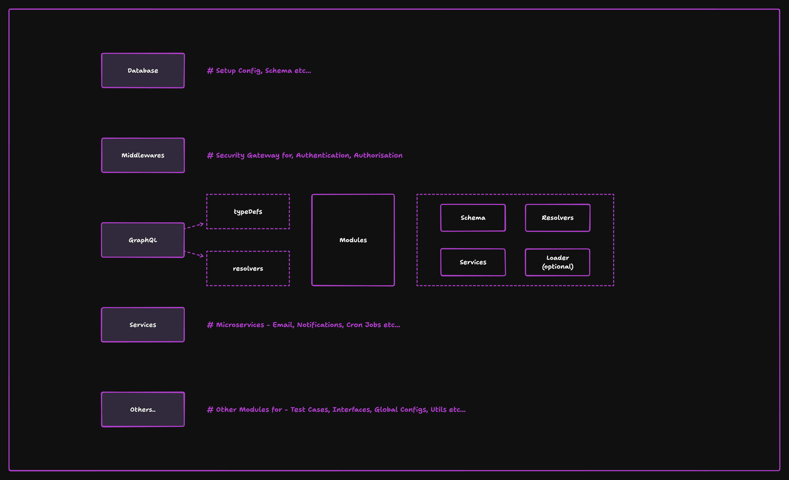

# GraphQL + Apollo Server with Express.js and TypeScript

This repository implements a **scalable, modular, and robust backend architecture** using:
- **GraphQL (Apollo Server)** for the API gateway.
- **Express.js** for middleware and server configuration.
- **TypeScript** for type safety and maintainability.
- A service-oriented, reusable structure to ensure scalability.

---

# Overview - Architecture


## 📁 Folder Structure

```
src/
├── modules/              # Feature-based modular structure
│   ├── user/             # Example module
│   │   ├── resolvers/    # GraphQL resolvers
│   │   ├── services/     # Business logic
│   │   ├── models/       # Data models (TypeScript interfaces/classes)
│   │   ├── loaders/      # DataLoaders (batching & caching)
│   │   ├── schema.ts     # GraphQL schema (type definitions)
│   │   └── index.ts      # Module entry point
│   └── product/          # Another feature module
├── utils/                # Shared utility functions (e.g., error handling, logging)
├── config/               # Configuration files (e.g., environment variables)
├── graphql/              # Apollo Server setup
│   ├── context.ts        # Context generation (auth, loaders, etc.)
│   ├── schema.ts         # Root schema stitching
│   └── server.ts         # Apollo Server instance
├── middlewares/          # Express middlewares (e.g., auth, rate limiting)
├── types/                # Global TypeScript types
├── services/             # Reusable services (e.g., email, notifications)
├── database/             # Database connection & ORM models
├── tests/                # Unit and integration tests
└── app.ts                # Express server entry point
```

---

## 🚀 Features

1. **GraphQL Gateway**:
   - Modular schemas and resolvers for scalability.
   - Schema stitching for combining multiple modules.

2. **Express.js Middleware**:
   - Secure with Helmet and rate limiting.
   - Logging with Morgan.

3. **TypeScript Integration**:
   - End-to-end type safety.
   - Easy-to-maintain interfaces and models.

4. **Efficient Data Fetching**:
   - Batch and cache database queries with **DataLoader**.

5. **Service-Oriented Architecture**:
   - Reusable, stateless services for business logic.

6. **Error Handling**:
   - Centralized error handling with GraphQL extensions.

---

## 🛠️ Setup Instructions

### Prerequisites
- Node.js >= 16.x
- npm or yarn
- Docker (optional for containerization)

### Installation
1. Clone the repository:
   ```bash
   git clone https://github.com/your-repo-url.git
   cd your-repo-name
   ```

2. Install dependencies:
   ```bash
   npm install
   ```

3. Configure environment variables:
   - Create a `.env` file in the root directory.
   - Add necessary variables like database connection strings, secret keys, etc.

4. Start the development server:
   ```bash
   npm run dev
   ```

---

## 🧩 Scripts

- **Start development server**: `npm run dev`
- **Build for production**: `npm run build`
- **Run tests**: `npm run test`

---

## 📚 Example GraphQL Query

Here's an example query to test your GraphQL API:

```graphql
query {
  getUserById(id: "123") {
    id
    name
    email
  }
}
```

---

## 🏗️ Built With

- [Apollo Server](https://www.apollographql.com/docs/apollo-server/) - GraphQL API Gateway
- [Express.js](https://expressjs.com/) - Web framework for Node.js
- [TypeScript](https://www.typescriptlang.org/) - Type-safe JavaScript
- [DataLoader](https://github.com/graphql/dataloader) - Batching and caching for efficient database queries
- [Prisma](https://www.prisma.io/) - ORM for database operations (optional)

---

## 📄 License

This project is licensed under the MIT License - see the [LICENSE](LICENSE) file for details.

---

## ❤️ Contributing

Contributions are welcome! Please fork the repository and submit a pull request with your changes.

---

## 📧 Contact

For questions or support, feel free to reach out at `arpitv970@gmail.com`.
